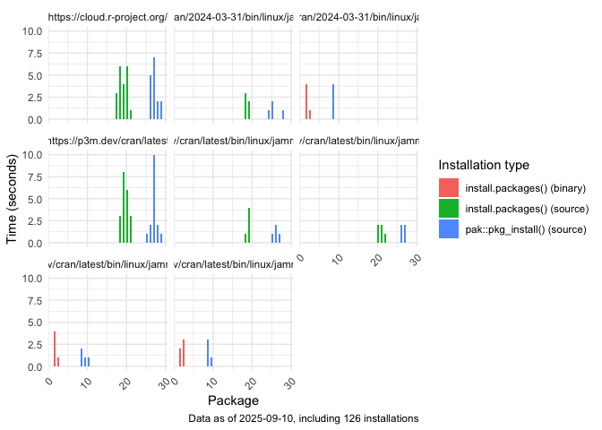

# R Package Installations

This repository contains a workflow that analyzes different strategies
for installing R packages. Particularly, it compares using
`install.packages()` vs `pak::pkg_install()` in different combinations
of CRAN versions as well as architectures. The main workflow
[here](./.github/workflows/install_an_r_package.yaml) runs the installs
and saves the output as csv files under [data](./data).

## Preliminary analysis

As of 2025-09-10, the following tables show the distribution of the
successful installations by method and source of the installed package
(total: 154 successful installations vs 10 failed installations):

|                                                             | source |
|:------------------------------------------------------------|-------:|
| https://cloud.r-project.org/                                |     20 |
| https://p3m.dev/cran/2024-03-31/bin/linux/jammy-aarch64/4.4 |      5 |
| https://p3m.dev/cran/2024-03-31/bin/linux/jammy-x86_64/4.4  |      5 |
| https://p3m.dev/cran/latest                                 |     20 |
| https://p3m.dev/cran/latest/bin/linux/jammy-aarch64/4.4     |      5 |
| https://p3m.dev/cran/latest/bin/linux/jammy-aarch64/4.5     |      5 |
| https://p3m.dev/cran/latest/bin/linux/jammy-x86_64/4.4      |      5 |
| https://p3m.dev/cran/latest/bin/linux/jammy-x86_64/4.5      |      5 |

Using pak::pkg_install()

|                                                             | binary | source |
|:------------------------------------------------------------|-------:|-------:|
| https://cloud.r-project.org/                                |      0 |     24 |
| https://p3m.dev/cran/2024-03-31/bin/linux/jammy-aarch64/4.4 |      0 |      6 |
| https://p3m.dev/cran/2024-03-31/bin/linux/jammy-x86_64/4.4  |      6 |      0 |
| https://p3m.dev/cran/latest                                 |      0 |     24 |
| https://p3m.dev/cran/latest/bin/linux/jammy-aarch64/4.4     |      0 |      6 |
| https://p3m.dev/cran/latest/bin/linux/jammy-aarch64/4.5     |      0 |      6 |
| https://p3m.dev/cran/latest/bin/linux/jammy-x86_64/4.4      |      6 |      0 |
| https://p3m.dev/cran/latest/bin/linux/jammy-x86_64/4.5      |      6 |      0 |

Using install.packages()

The following figure shows the installation times (in seconds) for the
`data.table` package using different methods and CRAN versions. So far,
`pak` is only using source for installations, even when the CRAN
repository is set to the specific OS architecture (e.g.,
`__linux__/jammy`):

Looking at using source vs binary installation:

## Implementation details

### The installation process

1.  Initialize the job inside the corresponding rocker container.
2.  Try to install the `data.table` package (needs compilation).
3.  Print the installation output. Using that, check whether a source or
    a binary version was installed (check the regex
    `installing [*]source[*]` if it is `install.packages` or
    `Building {}` if it is `pak::pkg_install`).
4.  Record the installation time and any relevant system information.
    The filename is a hash of the file itself.
5.  The output is stored as an artifact. Once all jobs are complete, the
    artifacts are combined into a single CSV file, which is then
    uploaded to the repository via a commit.

## Random observations

- \[2025-09-10 gvegayon\] `pak` does not seem to be working as expected.
  All instalations using the `pak` package in the `rocker/r-ver`
  containers have been from source, even when the CRAN repository is set
  to the specific OS architecture (e.g., `__linux__/jammy`).

- \[2025-09-03 gvegayon\] The posit public package manager (p3m) seems
  to contain multiple snapshot versions of compiled packages. As of
  September 3, 2025, the latest 8 versions of data.table (from 1.16.0 in
  October 10, 2024 up to 1.17.8 in July 10, 2025) are available as
  binaries for Mac OS arm64 chips. Nonetheless, running the same
  installer in the `rocker/r-ver:4.5.1` container results in a different
  behavior, always installing the source version of the package.
