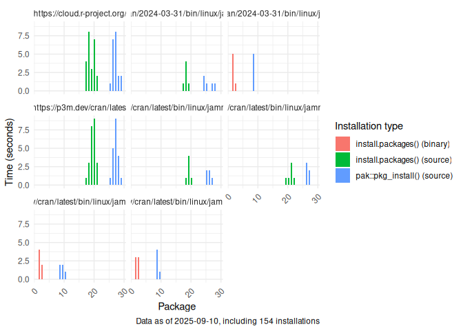

# R Package Installations

This repository contains a workflow that analyzes different strategies
for installing R packages. Particularly, it compares using
`install.packages()` vs `pak::pkg_install()` in different combinations
of CRAN versions as well as architectures. The main workflow
[here](./.github/workflows/install_an_r_package.yaml) runs the installs
and saves the output as csv files under [data](./data).

## Preliminary analysis

The following table shows the distribution of the installations so far:

|                                                             | source |
|:------------------------------------------------------------|-------:|
| https://cloud.r-project.org/                                |      8 |
| https://p3m.dev/cran/2024-03-31/bin/linux/jammy-aarch64/4.4 |      2 |
| https://p3m.dev/cran/2024-03-31/bin/linux/jammy-x86_64/4.4  |      2 |
| https://p3m.dev/cran/latest                                 |      8 |
| https://p3m.dev/cran/latest/bin/linux/jammy-aarch64/4.4     |      2 |
| https://p3m.dev/cran/latest/bin/linux/jammy-aarch64/4.5     |      2 |
| https://p3m.dev/cran/latest/bin/linux/jammy-x86_64/4.4      |      2 |
| https://p3m.dev/cran/latest/bin/linux/jammy-x86_64/4.5      |      2 |

Using pak::pkg_install()

|                                                             | binary | source |
|:------------------------------------------------------------|-------:|-------:|
| https://cloud.r-project.org/                                |      0 |      8 |
| https://p3m.dev/cran/2024-03-31/bin/linux/jammy-aarch64/4.4 |      0 |      2 |
| https://p3m.dev/cran/2024-03-31/bin/linux/jammy-x86_64/4.4  |      2 |      0 |
| https://p3m.dev/cran/latest                                 |      0 |      8 |
| https://p3m.dev/cran/latest/bin/linux/jammy-aarch64/4.4     |      0 |      2 |
| https://p3m.dev/cran/latest/bin/linux/jammy-aarch64/4.5     |      0 |      2 |
| https://p3m.dev/cran/latest/bin/linux/jammy-x86_64/4.4      |      2 |      0 |
| https://p3m.dev/cran/latest/bin/linux/jammy-x86_64/4.5      |      2 |      0 |

Using install.packages()

The following figure shows the installation times (in seconds) for the
`data.table` package using different methods and CRAN versions. Overall,
`pak` seems to be faster when `option("repos")["CRAN"]` points to the
specific OS architecture of the system (e.g., `__linux__/jammy`). When
installing form source, `install.packages()` seems faster:

Looking at using source vs binary installation:

## Implementation details

### The installation process

1.  Initialize the job inside the corresponding rocker container.
2.  Try to install the `data.table` package (needs compilation).
3.  Print the installation output. Using that, check whether a source or
    a binary version was installed (check the regex
    `installing [*]source[*]`)
4.  Record the installation time and any relevant system information.
    The filename is a hash of the file itself.
5.  The output is stored as an artifact. Once all jobs are complete, the
    artifacts are combined into a single CSV file, which is then
    uploaded to the repository via a commit.

## Random observations

- The posit public package manager (p3m) seems to contain multiple
  snapshot versions of compiled packages. As of September 3, 2025, the
  latest 8 versions of data.table (from 1.16.0 in October 10, 2024 up to
  1.17.8 in July 10, 2025) are available as binaries for Mac OS arm64
  chips. Nonetheless, running the same installer in the
  `rocker/r-ver:4.5.1` container results in a different behavior, always
  installing the source version of the package.
